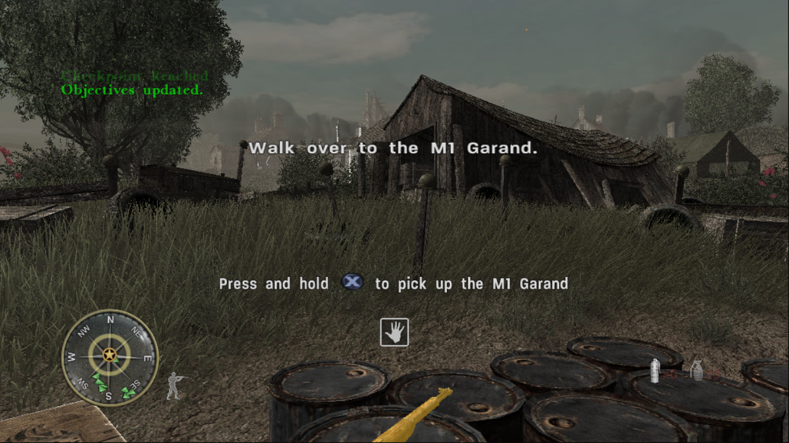

# CoD3Recomp

Static recompilation of Call of Duty 3 (Xbox 360) to native x86-64, using
[XenonRecomp](https://github.com/hedge-dev/XenonRecomp).

The game's PowerPC code translates to C++ and compiles cleanly: 19,462
functions, every instruction translated. All 179 Xbox 360 kernel imports are
implemented, memory mapped I/O reaches the GPU register file, and a command
processor decodes the packets the graphics driver queues.

`CoD3.exe` installs the game from your own disc image and boots it into a window.
The first level, Saint-Lô, is playable: the menus, the loading screen, the
opening cutscene and the fighting run at the title's own 60 frames a second
on the host's GPU through a Direct3D 11 renderer built for a PC (see
[docs/renderer.md](docs/renderer.md)), drawn from the title's own shaders
translated to HLSL, with the terrain, the buildings, the soldiers, the grass,
the sky, the shadows, the HUD and the saved checkpoints all working, at the
window's resolution with mip mapped, anisotropically filtered textures,
FXAA and vertical sync. All fifteen levels' code is recompiled and every
level loads and plays, the mission title cards, the mission failed screen
and the checkpoints with them. The intro films do not play yet.



### Keys and mouse

The keyboard and mouse stand in for the console's pad. In a level the window
takes the mouse and looks with it; Escape gives it back and pauses; a click
takes it again. Every key can be changed in the settings menu.

| | |
| --- | --- |
| Mouse | look; Mouse 1 fires, Mouse 2 aims; the wheel changes weapon |
| W A S D | move |
| Space | jump |
| C | crouch |
| E / R | use / reload |
| F | change weapon |
| V | melee |
| G / 4 | grenade / smoke |
| Shift | sprint |
| Tab | objectives |
| Escape | pause |
| Enter, arrows | the menus |
| F11 | settings menu |
| F12 | screenshot into `screenshots/` |

The settings menu (F11) has the window mode (windowed or borderless full
screen; Alt+Enter switches too), the internal resolution (the window's
height, or a multiple of the title's 1040 by 624), the texture filtering
and anisotropy, anti aliasing (FXAA), vertical sync, a frame counter and
the renderer's statistics, the mouse sensitivity, the title's aim assist,
the pad, and the keys. It keeps its values in `CoD3Recomp.ini` beside the
executable. `CoD3.cfg` beside the executable holds console commands run at
start (`seta com_maxfps 60` by default). The same settings can be forced
from the environment for a run: `COD3_SCALE`, `COD3_TEXTURE_FILTER`,
`COD3_ANISO`, `COD3_AA`, `COD3_VSYNC`, `COD3_FULLSCREEN`; and
`COD3_RENDER_STATS=1` prints the renderer's counters once a second.

Saved games go to `saves/` beside the executable.

A pad works as well when one is plugged in.

Read [STATUS.md](STATUS.md) for what works, how it was measured, and what a
playable build would take.

The instructions this project added to the recompiler are checked against Xenia's
PowerPC instruction tests, and all 16 that have a test pass.

## Build

```powershell
.\scripts\recompile.ps1 -BuildTools -BuildLib -BuildHost
```

Needs CMake 3.20+, Ninja, Clang, and the Visual Studio Build Tools for the
Windows SDK headers. Clang is required, not preferred.

Put your own `default.xex` in `CoD3RecompLib/private/` first, so the recompiler
has something to translate. No game files are included here.

## Verifying

```powershell
.\scripts\verify.ps1        # the instructions this project added
.\scripts\verify.ps1 -All   # every test Xenia has
```

Assembles Xenia's instruction tests, recompiles them the same way the game's
code is recompiled, runs them, and reports any register that comes out wrong.

## Running

`CoD3.exe` looks for a `game` folder next to itself. If it is not there, first
time setup runs and offers three ways to supply the game:

1. Extract from an Xbox 360 disc image. XGD1, XGD2, XGD3 and stripped images are
   all recognised.
2. Copy from a folder you already extracted.
3. Use a folder you already extracted, where it is, copying nothing. The path is
   remembered in `game.path`.

Setup checks that the disc holds a `default.xex` of the same size as the one
this build was recompiled from, before writing several gigabytes.

Started from Explorer, the window waits for a key before closing, so the output
can be read. Started from a shell it exits straight away and leaves the prompt
alone.

The picker dialogs can be skipped:

```
CoD3.exe --iso "D:\path\Call of Duty 3.iso"
CoD3.exe --game "D:\path\Call of Duty 3 (USA, Europe)"
CoD3.exe --list-iso "D:\path\Call of Duty 3.iso"
CoD3.exe --help
```

A level can be started straight from the main menu, the way the chapter
select does it, with `COD3_MAP=<level>[,<second>]` in the environment: at that
second (twelve by default) the title's own `spmap <level>` console command is
put on its command buffer. The main menu has to be up by then, which
`COD3_PAD="5:start 8:a"` (Start at five seconds, A at eight) sees to in a
scripted run. The level names are the folders under `sp`: `saint_lo`,
`island`, `nightd`, `crssrds`, `hostage`, `mayenne`, `forest`, `falaise`,
`fuelplnt`, `chambois`, `mace2`, `laison`, `stbert`, `blkbrn`, `credits`.

## Layout

| Path | |
| --- | --- |
| `CoD3RecompLib/config/CoD3.toml` | Recompiler configuration, with every address documented |
| `CoD3RecompLib/config/CoD3_switch_tables.toml` | 323 jump tables, from XenonAnalyse |
| `CoD3RecompLib/ppc/` | Generated C++. Never edit; regenerate |
| `CoD3RecompLib/private/` | Your game files. Not in version control |
| `CoD3Host/` | The executable: setup, disc image reader, guest memory, the kernel |
| `CoD3Host/kernel_*.cpp` | The kernel by area: memory, system, objects, files, Xam, threads |
| `CoD3Host/implemented_imports.txt` | Which imports are real. Add a name here when you implement one |
| `CoD3Host/kernel_stubs.cpp` | Generated for everything not on that list |
| `tools/XenonRecomp/` | The recompiler, with local fixes described in STATUS.md |
| `CoD3Host/xenos_hlsl.cpp` | The title's shader microcode translated to HLSL |
| `CoD3Host/render*.cpp` | The Direct3D 11 renderer: state, pipeline and shader caches, resources, stats, the device ([docs/renderer.md](docs/renderer.md)) |
| `scripts/compare_frames.py` | Compares two runs' frame dumps, for the renderer's visual regression check |
| `CoD3Host/overlay.cpp`, `settings.cpp` | The settings menu (Dear ImGui) and its file |
| `tools/CoD3Scan/` | XEX analysis: finds required addresses, repairs function boundaries, lists imports |
| `scripts/recompile.ps1` | The whole pipeline, the coroutine patch (`scripts/patch_recomp.py main`) included; running XenonRecomp by hand needs that patch afterwards or the first level's scripts spin forever |
| `scripts/verify.ps1` | Checks the recompiler against Xenia's instruction tests |
| `tools/PpcAsm/` | A PowerPC assembler, built from the project's own opcode tables |
| `CoD3Host/gpu.cpp` | The GPU register aperture and the PM4 command processor |
| `thirdparty/imgui/` | Dear ImGui, for the menu |
| `CoD3Host/sampler.cpp` | Names the guest function each thread is in, without debug symbols |
| `CoD3RecompLib/include/cod3_mmio.h` | Routes guest register access to the GPU instead of RAM |
| `docs/kernel-imports.txt` | The 179 imports a runtime has to provide |

## CoD3Scan

```
CoD3Scan <default.xex>                      # layout, save/restore helpers, longjmp candidates
CoD3Scan <default.xex> --imports            # every kernel import with its thunk address
CoD3Scan <default.xex> --fixfuncs <log>     # explicit function boundaries from a recompiler log
CoD3Scan <default.xex> --func 0xADDR        # which .pdata entry covers an address
CoD3Scan <default.xex> --find D9C30000      # byte-pattern search across code sections
CoD3Scan <default.xex> --disasm 0xADDR 40   # disassemble a window
```
