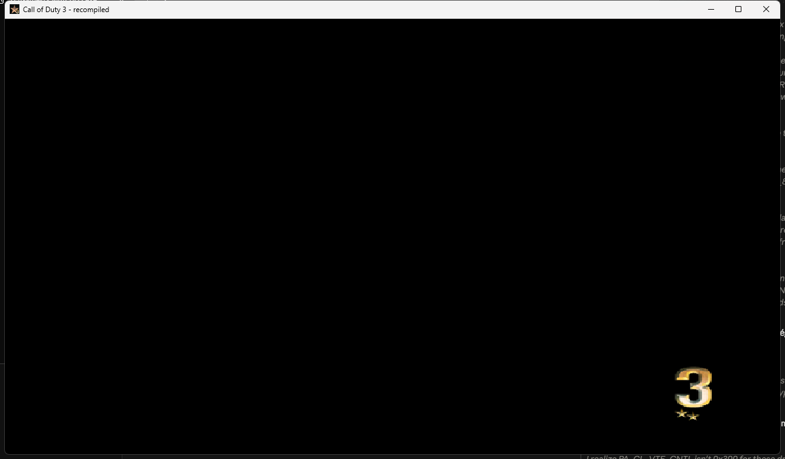
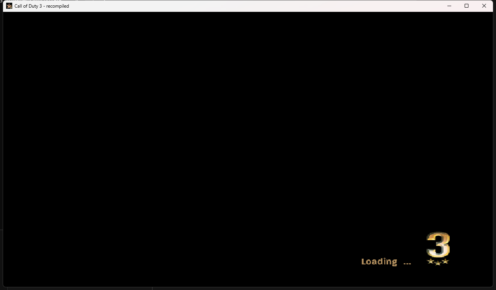

# CoD3Recomp

Static recompilation of Call of Duty 3 (Xbox 360) to native x86-64, using
[XenonRecomp](https://github.com/hedge-dev/XenonRecomp).

The game's PowerPC code translates to C++ and compiles cleanly: 19,462
functions, every instruction translated. All 179 Xbox 360 kernel imports are
implemented, memory mapped I/O reaches the GPU register file, and a command
processor decodes the packets the graphics driver queues.

`CoD3.exe` installs the game from your own disc image and boots it into a window.
The title reads its configuration, opens its main asset archive, and runs a real
frame loop: around 760 draw calls a second, resolving a finished 1040 by 624
frame out of EDRAM about fourteen times a second into the buffer it then
presents.

**The loading screen is on screen.** The path runs end to end: packets decoded,
register file tracked, the title's own shader microcode interpreted instruction
by instruction, triangles rasterised into EDRAM, and the finished surface
resolved out and presented. Nothing is approximated on the way: the geometry,
the colours and the texture all come from the title's own data.



It reaches its loading screen, animates it, streams its way through its asset
archive, loads the sound banks and the animation data, and opens `frontEnd.cod`,
the menu package, and streams about nine megabytes of it. It does not get
loads it, and draws its loading screen: the text and the mark over a dark
background, with quads, compressed textures and alpha blending all doing their
part. Getting there meant giving the runtime the console's six hardware threads:
guest threads that share one take turns, which is what stops two of them from
being inside the same unlocked frame arena at once.



It reaches its intro films: twenty seven files and 26.7 MB in, it opens
`legal-us.wmv`, `ATVI.wmv`, `Treyarch.wmv` and `Attract.wmv`, the sequence that
runs before the menu. It cannot play them, and that is where it stops. The runtime says so in detail, with the guest call
chain and the globals involved, rather than leaving it to be guessed at.

It is a long way from playable. Depth testing and blending are ignored, sampling
is nearest with no filtering, and most vertex and texture formats are not
decoded. Each gap names itself at run time rather than quietly drawing something
wrong.

Read [STATUS.md](STATUS.md) for what works, how it was measured, and what a
playable build would take.

The instructions this project added to the recompiler are checked against Xenia's
PowerPC instruction tests, and all 16 that have a test pass.

## Build

```powershell
.\scripts\recompile.ps1 -BuildTools -BuildLib -BuildHost
```

Needs CMake 3.20+, Ninja, Clang, and the Visual Studio Build Tools for the
Windows SDK headers. Clang is required, not preferred.

Put your own `default.xex` in `CoD3RecompLib/private/` first, so the recompiler
has something to translate. No game files are included here.

## Verifying

```powershell
.\scripts\verify.ps1        # the instructions this project added
.\scripts\verify.ps1 -All   # every test Xenia has
```

Assembles Xenia's instruction tests, recompiles them the same way the game's
code is recompiled, runs them, and reports any register that comes out wrong.

## Running

`CoD3.exe` looks for a `game` folder next to itself. If it is not there, first
time setup runs and offers three ways to supply the game:

1. Extract from an Xbox 360 disc image. XGD1, XGD2, XGD3 and stripped images are
   all recognised.
2. Copy from a folder you already extracted.
3. Use a folder you already extracted, where it is, copying nothing. The path is
   remembered in `game.path`.

Setup checks that the disc holds a `default.xex` of the same size as the one
this build was recompiled from, before writing several gigabytes.

Started from Explorer, the window waits for a key before closing, so the output
can be read. Started from a shell it exits straight away and leaves the prompt
alone.

The picker dialogs can be skipped:

```
CoD3.exe --iso "D:\path\Call of Duty 3.iso"
CoD3.exe --game "D:\path\Call of Duty 3 (USA, Europe)"
CoD3.exe --list-iso "D:\path\Call of Duty 3.iso"
CoD3.exe --help
```

## Layout

| Path | |
| --- | --- |
| `CoD3RecompLib/config/CoD3.toml` | Recompiler configuration, with every address documented |
| `CoD3RecompLib/config/CoD3_switch_tables.toml` | 323 jump tables, from XenonAnalyse |
| `CoD3RecompLib/ppc/` | Generated C++. Never edit; regenerate |
| `CoD3RecompLib/private/` | Your game files. Not in version control |
| `CoD3Host/` | The executable: setup, disc image reader, guest memory, the kernel |
| `CoD3Host/kernel_*.cpp` | The kernel by area: memory, system, objects, files, Xam, threads |
| `CoD3Host/implemented_imports.txt` | Which imports are real. Add a name here when you implement one |
| `CoD3Host/kernel_stubs.cpp` | Generated for everything not on that list |
| `tools/XenonRecomp/` | The recompiler, with local fixes described in STATUS.md |
| `tools/XenosRecomp/` | Shader recompiler. Cloned, not used yet |
| `tools/CoD3Scan/` | XEX analysis: finds required addresses, repairs function boundaries, lists imports |
| `scripts/recompile.ps1` | The whole pipeline |
| `scripts/verify.ps1` | Checks the recompiler against Xenia's instruction tests |
| `tools/PpcAsm/` | A PowerPC assembler, built from the project's own opcode tables |
| `CoD3Host/gpu.cpp` | The GPU register aperture and the PM4 command processor |
| `CoD3Host/sampler.cpp` | Names the guest function each thread is in, without debug symbols |
| `CoD3RecompLib/include/cod3_mmio.h` | Routes guest register access to the GPU instead of RAM |
| `docs/kernel-imports.txt` | The 179 imports a runtime has to provide |

## CoD3Scan

```
CoD3Scan <default.xex>                      # layout, save/restore helpers, longjmp candidates
CoD3Scan <default.xex> --imports            # every kernel import with its thunk address
CoD3Scan <default.xex> --fixfuncs <log>     # explicit function boundaries from a recompiler log
CoD3Scan <default.xex> --func 0xADDR        # which .pdata entry covers an address
CoD3Scan <default.xex> --find D9C30000      # byte-pattern search across code sections
CoD3Scan <default.xex> --disasm 0xADDR 40   # disassemble a window
```
